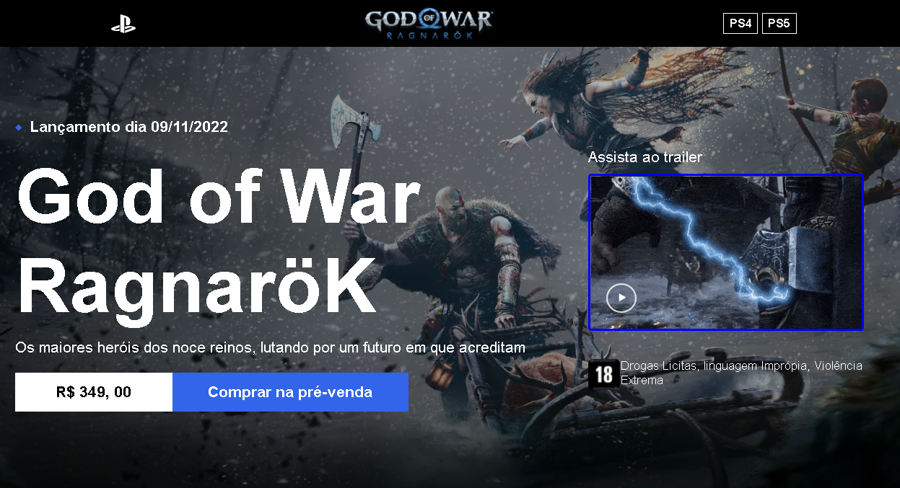
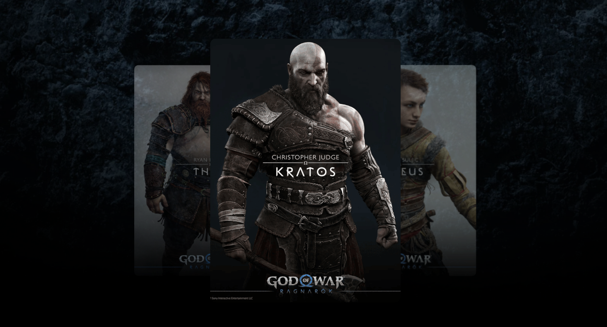

# God of War Tribute Website

  
  

---

## 😅 Descrição 😍

Bem-vindo ao projeto God of War Tribute Website! Este projeto foi inspirado no jogo God of War Ragnarok e apresentado no curso [Codeboost](https://codeboost.com.br/). Embora não tenha sido desenvolvido durante o curso, achei a ideia interessante e decidi criar um site com base no tema do jogo. Utilizei o projeto de uma talentosa aluna, [Rauane Lima](https://www.linkedin.com/in/rauanee/), como base. O site destaca a aventura, os personagens e as mecânicas de plataforma do jogo.

---

## 🚀 Tecnologias

Este projeto foi construído utilizando as seguintes tecnologias:

- HTML
- CSS
- JavaScript
- Bootstrap
- Sass

---

## ✨ Informações

O projeto apresenta as seguintes características:

- Layout responsivo para diferentes dispositivos
- Utilização de HTML5 Semântico para melhorar a otimização nos mecanismos de busca
- Integração da biblioteca de animação de texto [Animate On Scroll](https://michalsnik.github.io/aos/)

---

## 🛠 IDE Utilizada

- Visual Studio Code

---

## 🔎 Deploy

Confira o site hospedado através do link abaixo:

### [God of War Tribute Website - Hospedagem](https://ramon-rodrigues-001.github.io/God-Of-War/)

